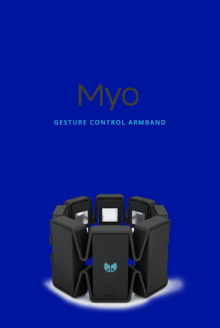
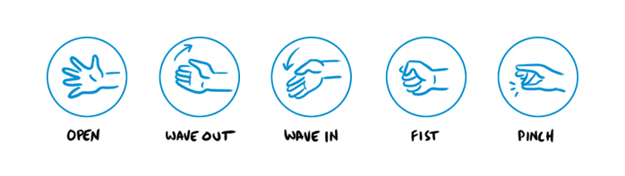

# Myo Android

This is an example of an Android Application to use with [MYO](https://www.myo.com/). The App is a very simple selector of chapters using one serie available in Youtube.

This app use the Youtube API for android, so if you want to use it, or maybe, you want to use like a base to do something more complicated, you need to have a Youtube Developer Key, see the Developer section to get more information about it.

## App Structure
This app have only one MainActivity with a [DrawerLayout](https://developer.android.com/reference/android/support/v4/widget/DrawerLayout.html) as root layout. This allow us to have a left drawer layout, the selector of chapters.

## Myo Gestures Control

In this picture we can see some of the gestures myo allow us to do.
When you init the app, a video is loaded and playing in the first screen, you can pause it doing the FIST pose and play again with OPEN pose.
WAVE OUT and WAVE IN allow you open and close the selector of chapters, and with the selector open, you can navigate in a chapter's list moving your arm in the Y-axis, from up to down, to select one, just do the FIST pose.
Finally, spinning your arm, you can change the volume of the video and with the PINCH pose, you can play video in fullscreen mode.

## Developers
If you want to use this app, you need a developer key to use Youtube API.
Please, [folow this steps](https://developers.google.com/youtube/android/player/register) to obtain your DeveloperKey and copy it in the file "DeveloperKey.java".
